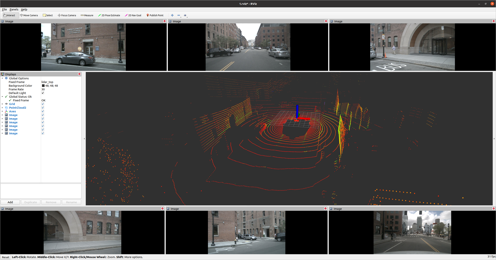
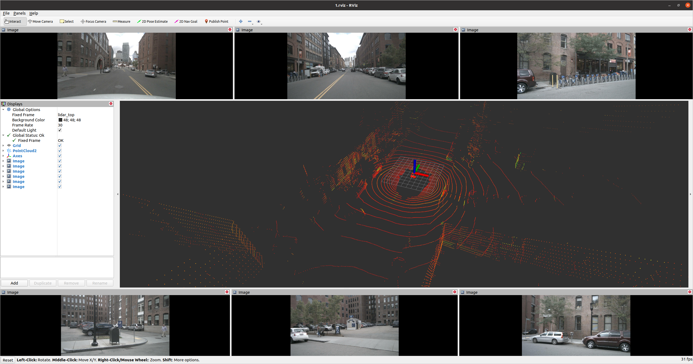

# `nuscenes2bag`

`nuscenes`数据集转换成`rosbag`包

## 1 下载编译

~~~python
# 1. 建立ros工作空间
mkdir -p nus2bag_ws/src

# 2. 拉取源码
cd nus2bag_ws/src
git clone https://github.com/linClubs/nuscenes2rosbag.git

# 3. 安装功能包所需依赖
cd ..
rosdep install -r -y --from-paths src --ignore-src --rosdistro $ROS_DISTRO

# 4. 编译
catkin_make
~~~

## 2 Converting the 'mini' dataset:

1. 下载mini数据集

[下载地址](https://link.csdn.net/?target=https%3A%2F%2Fwww.nuscenes.org%2Fnuscenes%23download)

需要注册登录后才能下载

下载 **`Map expansion-v1.3`版** 与 **`Full dataset(v1.0)-mini`**版本即可

下载后解压得到`nuScenes-map-expansion-v1.3`与`v1.0-mini`两个文件夹, 把`nuScenes-map-expansion-v1.3`中的三个文件复制到`v1.0-mini/map`目录下。最终得到新`v1.0-mini`文件夹重命名为`nuscenes`数据集目录结构如下：

~~~python
nuscenes/
    ├── maps
        ├── 36092f0b03a857c6a3403e25b4b7aab3.png
        ├── 37819e65e09e5547b8a3ceaefba56bb2.png
        ├── 53992ee3023e5494b90c316c183be829.png
        ├── 93406b464a165eaba6d9de76ca09f5da.png
        ├── basemap
        ├── expansion
        └── prediction
    ├── samples
    ├── sweeps
    └── v1.0-mini
~~~

2. 将`mini`中`103`场景转成ros包

~~~python
# 先source ros工作空间
source devel/setup.bash
# 不source会报错Error: package 'nuscenes2bag' not found

# 运行
rosrun nuscenes2bag nuscenes2bag --scene_number 0061 --dataroot data/nuscenes/ --out nuscenes_bags/
~~~

+ --scene_number    场景  0061 0103
+ --dataroot        数据路径
+ --out             rosbag保存地址
+ --version         可选参数 `v1.0-mini`(默认) , `v1.0-trainval`
+ --jobs            4 同时处理4个场景

+ `mini`中所有场景
~~~python
103.bag   1094.bag  553.bag  655.bag  796.bag
1077.bag  1100.bag  61.bag   757.bag  916.bag
~~~

4. 转换所有`mini`场景数据集 

~~~python
# 先source ros工作空间
source devel/setup.bash
# 不source会报错Error: package 'nuscenes2bag' not found

# 运行
rosrun nuscenes2bag nuscenes2bag --dataroot /home/lin/code/maptr2/MapTR/data/nuscenes/ --out nuscenes_bags/ --jobs 4
~~~

5. 可视化
~~~python
# 1. 播放数据集
rosbag play 103.bag -l

# 2 打开可视化窗口
roslaunch nuscenes2bag view.launch
~~~

